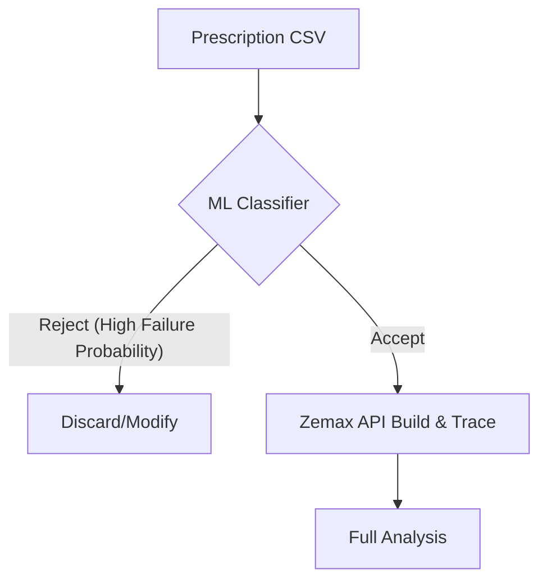

# Future Machine Learning Screening Plan

This document outlines the proposed roadmap for utilizing the structured triage dataset to build an offline machine learning screening model. The goal is to filter out structurally unfeasible or trace-failing lens configurations *before* launching expensive Zemax OpticStudio instances.

## Conceptual Framework

Zemax ray-tracing is computationally heavy and requires a licensed OpticStudio engine. Machine learning classifiers can predict whether a given starting topology (radii, thicknesses, glasses, aspheric coefficients) will violate mechanical constraints or fail high-field ray tracing.

## Screening Workflow

### 1. Data Feature Engineering
- **Geometric Features**: Total sum of thicknesses (TTL proxy), individual element aspect ratios, front-to-rear thickness ratios, and curvature signs.
- **Material Features**: Index ($n_d$), Abbe ($v_d$), and relative partial dispersion values of each element.
- **Aspheric Complexity**: Magnitude of higher-order aspheric coefficients ($A_4$ to $A_{16}$).

### 2. Proposed ML Model Architectures
- **Constraint Violations (Regression)**: Predict TTL, BFL, and edge clearances directly from the prescription.
- **Trace Success (Binary Classification)**: Classify if the system will successfully trace a $high-field$ field under $F/2.5$ without edge pupil or vignetting clipping.
- **Failure Surface Predictor (Multi-class Classification)**: If the system fails, predict the most likely index of the failing surface to guide automated shape bending.

### 3. Training Protocol
- **Dataset**: Compiled tables in `data/processed/` summarizing valid and invalid structures.
- **Algorithms**: XGBoost/Random Forest for tabular feature importance analysis; PyTorch Multi-Layer Perceptrons (MLPs) for parameter search spaces.
- **Validation**: Strict train-test splits grouped by source family (e.g. training on CN families and testing on US families) to verify out-of-domain generalization.
