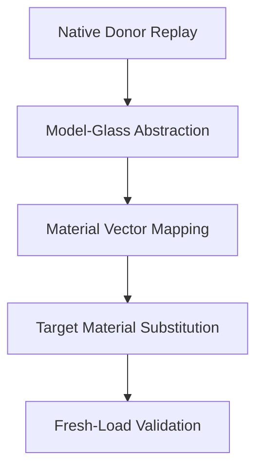

# Donor-to-Target Material Transfer Methodology

This document defines the methodology for separating optical structure feasibility from material-library compatibility when mapping public donor lens designs to target material libraries.

---

## 1. Problem Definition

Public donor lens prescriptions (from patents, literature, or generic databases) are designed using a wide range of global glass catalogs (e.g. CDGM, Schott, Ohara, Hoya). These catalogs do not align with the restricted target material library available on target sensors or modules (such as the restricted DJI glass library).

Directly replacing donor glasses with target materials of the same name or arbitrary nearest neighbors often triggers ray trace failures or severe aberrations, which conflates structural failures with material mapping incompatibilities. This prevents the generation of clean, valid training samples for initial structure machine learning models.

---

## 2. Material Mapping Pipeline

To decouple structure feasibility from material compatibility, we propose a five-stage mapping pipeline:

1. **Native Donor Replay (V0_native)**: Reconstruct the lens using original catalog glass definitions and verify baseline ray tracing.
2. **Model-Glass Abstraction (V1_model_glass)**: Convert elements to model glass solving ($n_d, v_d$) to verify if the structure is feasible under idealized dispersion conditions.
3. **Material Vector Mapping**: Convert glass properties and structural roles into a standardized vector representation.
4. **Target Material Substitution (V2_dji_nearest / V3_dji_role_aware)**: Map the vectors to the target material library using specific scoring heuristics.
5. **Fresh-Load Validation**: Reload the design in standalone Zemax and verify paraxial and real ray tracing metrics.

---

## 3. Material Vector Representation

Each lens element's material is converted into a vector:
$$\mathbf{v} = [n_d, v_d, \text{material\_type}, \text{lens\_role}, \text{power\_sign}, \text{position\_role}]$$

- **$n_d, v_d$**: Refractive index and Abbe number.
- **material_type**: `glass`, `air` (for gaps), `plastic`, or `cover_plate`.
- **lens_role**: Element role (e.g. `L1`, `L2`, `STOP_ADJACENT`).
- **power_sign**: `+1` (positive power), `-1` (negative power), `0` (flat/afocal).
- **position_role**: Position relative to stop (`front_group`, `rear_group`, `stop`).

---

## 4. Matching Score Heuristic

The similarity score between a donor material vector $\mathbf{v}$ and a target catalog material $\mathbf{t}$ is defined by:
$$S(\mathbf{v}, \mathbf{t}) = w_n (n_{d,\mathbf{v}} - n_{d,\mathbf{t}})^2 + w_v (v_{d,\mathbf{v}} - v_{d,\mathbf{t}})^2 + P_{\text{role}} + P_{\text{missing}}$$

- **$w_n, w_v$**: Weight factors for index and dispersion distances.
- **$P_{\text{role}}$**: Role penalty if the target material's structural recommendation (e.g. high-refraction front element vs low-dispersion rear element) does not match `position_role` or `lens_role`.
- **$P_{\text{missing}}$**: Severe penalty if the candidate target material has restricted availability or is deprecated in the target catalog.

---

## 5. Mapping Versions

- **`V0_native`**: Raw patent catalog configuration.
- **`V1_model_glass`**: Idealized $n_d$/$v_d$ solves on all powered surfaces.
- **`V2_dji_nearest`**: Standard nearest $n_d$/$v_d$ matching from the target DJI catalog, ignoring structural roles.
- **`V3_dji_role_aware`**: Heuristic matching utilizing structural role penalties ($P_{\text{role}}$).

---

## 6. Transfer Label Classifications

After fresh-load validation, each transfer attempt is classified:

*   **`NATIVE_PASS`**: The V0 native build traces successfully and meets all paraxial goals.
*   **`NATIVE_PARTIAL`**: V0 traces but violates minor boundary conditions (e.g. BFL/TTL limits).
*   **`TRANSFER_PASS`**: V3 role-aware mapping successfully traces and exhibits minimal paraxial drift.
*   **`TRANSFER_DRIFT`**: V3 traces but focal length (EFL) or track length drifts slightly from baseline.
*   **`TRANSFER_FAIL`**: V3 fails ray tracing (vignetting, TIR, or ray aborts).
*   **`MATERIAL_INCOMPATIBLE`**: V1 model-glass passes, but both V2 and V3 fail, showing the target catalog lacks the necessary material coverage for this specific topology.

---

## 7. Scope & Limitations

This methodology is an archiving plan for design validation and data prep. No neural network training has been completed, and no official DJI lens designs are claimed.
